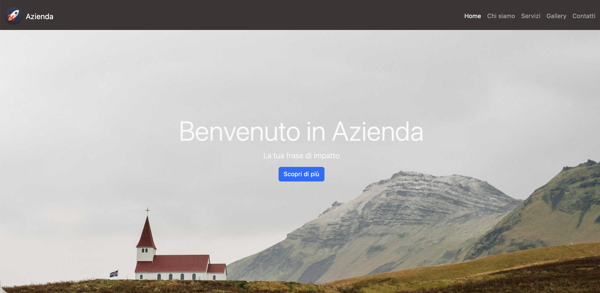
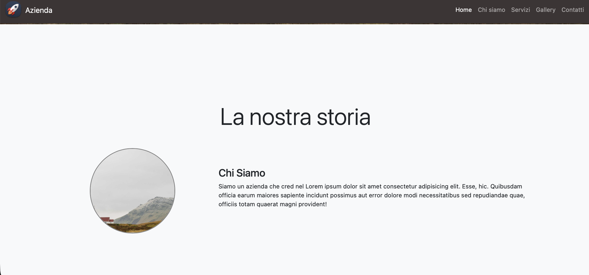
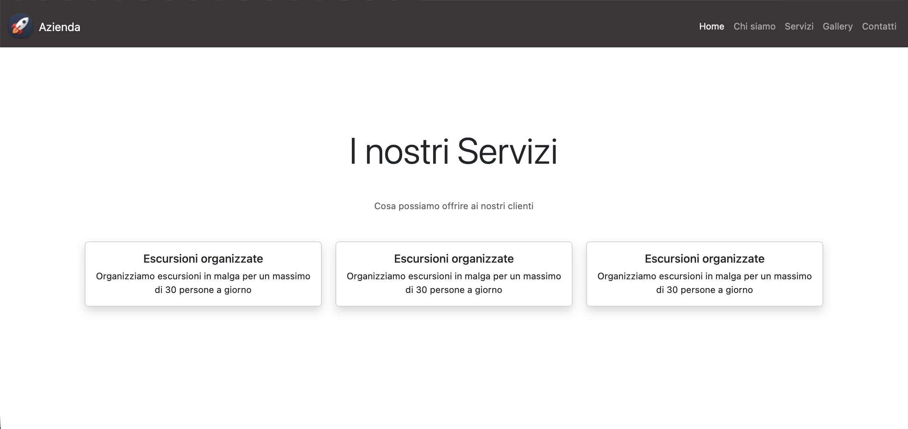
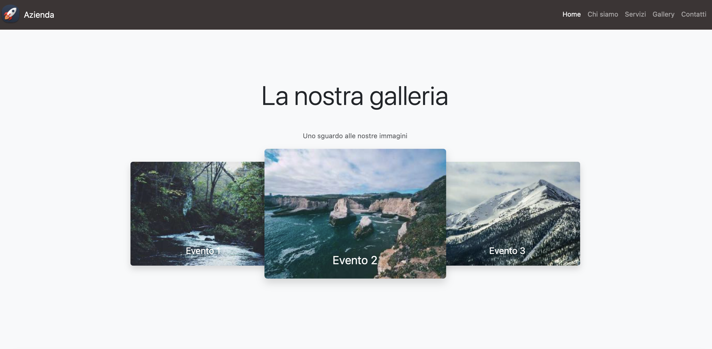
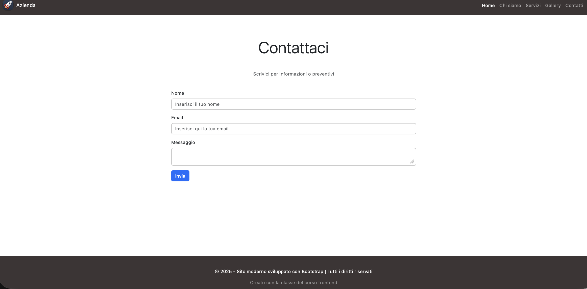

# Bootstrap Sito componenti
*Novembre 2025*

---

**Immagini dell' applicazione**






---


🔨
| Nome      | Linguaggio | Versione |
|-----------|------------|----------|
| Html      | Markup     | 5        |
| CSS       | Style      | 4        |
| JS        | Logic      | es7      |
| Bootstrap | Libreria   | 22.20    |


🖥️
```bash
cd ./SITO 
Avviare Golive da VS-Code per parte FrontEnd
